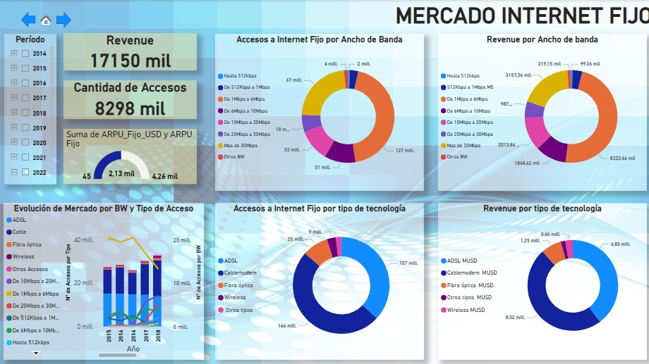

# CASO:` Industria Telco en Argentina`

---

## **Tabla de Contenidos**

---

**1.** [**Introducción**](#Section1)

**2.** [**Resumen del problema**](#Section2)

**3.** [**Aproximación metodológica**](#Section3)

**4.** [**Adquisición y descripción de datos**](#Section4)

- **4.1** [**Descripción de archivos**](#Section41)
- **4.2** [**Diccionario de datos**](#Section42)

**5.** [**Pre-Profiling**](#Section5)

**6.** [**Limpieza y wrangling de datos**](#Section6)

**7.** [**Post-Profiling**](#Section7)

**8.** [**Análisis Exploratorio de Datos - EDA (Exploratory Data Analysis)**](#Section8)

**9.** [**Resumen**](#Section9)

- **9.1** [**Conclusiones**](#Section91)
- **9.2** [**Información procesable**](#Section92)

---

### 1. Introducción

- En las últimas dos décadas, el acceso a Internet ha redefinido las reglas de la competitividad y la forma en que la Sociedad se relaciona.
- Existe una clara relación entre el aumento en las capacidades productivas de un país, y el aumento del ancho de banda en el transporte de señal, que hoy explican porcentajes importantes del PIB de muchos países en el orbe.
- Las economías han entendido que esta, es una carrera en la que no se puede ceder espacio a los avances y, que quedarse atrás (brecha digital), no es una opción.
- Argentina, pese a tener uno de los niveles más altos de penetración de internet en la región, también presenta agudos contrastes debido a varios factores que es necesario entender, tales como: geografía, densidad poblacional, infraestructura, riesgo social, político y otras externalidades, que requieren de un análisis de sus estadísticas con un enfoque estratégico, que sirva tanto, para los actuales competidores, como para potenciales entrantes.
- En este Lab, se procederá a análizar información histórica de la industria TELCO en Argentina, bajo el supuesto de servir a un tercero como herramienta para la toma de decisiones e información a través de un tablero (dashboard).
- Este ***dashboard*** ayudará al lector a comprender las características del mercado de "Acceso a Internet Fijo", en función de su localización, tipo de tecnología, ancho de banda, y tendencia de crecimiento del mercado, además de relacionar otros ***insights*** como políticas públicas y otras variables que determinan la demanda por el servicio en el largo plazo.
- ***Disclaimer:*** Las recomendaciones de este análisis, aunque se basan en datos reales, deben ser considerados como **'un ejercicio académico'**, y es responsabilidad del usuario verificar y validar el contenido del mismo para otros fines.

### 2. Resumen del Problema:

- Para ayudar al cliente, en su necesidad por conocer el comportamiento de este sector a nivel nacional, se ha aplicado una aproximación 'top-dow', para caracterizar primero, el mercado en general, incluyendo el acceso a internet desde dispositivos móviles, para luego enfocarme en el análisis y conclusiones, sobre el mercado de acceso a internet a través de redes fijas.
- Se buscará establecer relaciones significativas para fundamentar, con la información disponible, recomedaciones que permitan lograr, por ejemplo: una buena calidad de los servicios, identificar oportunidades de crecimiento, o cómo personalizar soluciones para sus posibles clientes.
- Se pondrá especial énfasis en analizar las fuentes de datos, para determinar qué objetivos de información son factibles, y cuáles podrían ser alcanzados con algún nivel, razonable, de esfuerzo adicional.
- Se requiere realizar un EDA bien documentado y coherente con las conclusiones, toda vez que, este artefacto constituye, generalmente, un entregable en sí mismo.
- Los esfuerzos se centrarán en ayudar a una empresa o cliente, a adquirir una visión comprehensiva de la industria, desarrollar algunas opciones estratégicas, y sugerirle información procesable que apoye sus decisiones de inversión, marketing y/o productos.

### 3. Aproximación metodológica

Hay académicos y literatura que sostienen que, el 'EDA', es un proceso contínuo, que no tiene fin, y un resultado, siempre será el inicio de un nuevo análisis, porque las variables o las necesidades de información, están en constante cambio, lo que obliga a aplicar meodologías o prácticas que permitan asegurar un resultado confiable.

El Análisis Exploratorio de Datos (EDA, por sus siglas en inglés), es una etapa esencial en el proceso de entender los datos y prepararlos para poder trabajar con ellos. Consiste en explorar y comprender los datos antes de aplicar cualquier modelo o técnica de análisis más avanzada.

La aproximación metodológica del EDA se puede describir en los siguientes pasos:

- Recopilación de datos: Se obtendrán los datos necesarios para el análisis, sea de fuentes externas o internas. Los datos pueden estar en diferentes formatos, como archivos CSV, bases de datos, hojas de cálculo, etc. En este caso, se descargarán los sets de datos que mantiene ENACOM, ente regulador de la actividad de la Industria en Argentina.
- Limpieza de datos: Se realizará una limpieza inicial de los datos para detectar y corregir problemas como: valores faltantes, duplicados, valores atípicos o inconsistentes. También se procederá, cuando corresponda, a realizar transformaciones de datos, que pueden incluir, la normalización y/o codificación de variables.
- Exploración univariable: Tedioso, pero necesario, donde se analizará cada variable, individualmente, para comprender su distribución, estadísticas descriptivas y características específicas. Esto puede incluir histogramas, gráficos de barras, resúmenes estadísticos y otros métodos visuales o numéricos.
- Exploración bivariable: Es el esfuerzo inicial por hallar relaciones entre variables. Se analiza la relación entre pares de variables para identificar patrones, correlaciones o dependencias. Esto puede incluir gráficos de dispersión, tablas de contingencia, matrices de correlación y pruebas estadísticas.
- Exploración multivariable: Dependiendo del objetivo del estudio y, si los datos son homogéneos y consistentes, se puede intentar realizar algún tipo de análisis multivariable, para evaluar la interacción entre múltiples variables simultáneamente y así comprender mejor la estructura y complejidad de los datos. Este tipo de análisis, puede incluir gráficos de dispersión en 3D, análisis de componentes principales, clustering o técnicas de visualización avanzadas. Sin embargo, considerando el objetivo, alcance y tipo de datos, este análisis se excluirá.
- Visualización de datos: En forma concurrente a los análisis previos, se utilizarán diversas técnicas y herramientas visuales para representar los datos de manera efectiva y comunicar los hallazgos. Esto puede incluir gráficos, diagramas, mapas, gráficos de caja (boxplots), entre otros.

Insights e hipótesis: A medida que se exploran los datos, se pueden generar y documentar hipótesis e insights sobre relaciones, patrones o tendencias que puedan existir entre los datos. Estas hipótesis pueden ser posteriormente validadas o refutadas en etapas posteriores del análisis, a través de métodos matemáticos o análisis especializados.

Notas metodológicas:

- Con el propósito de agilizar algunos análisis, se utilizará una función que recopila varias operaciones que se ejecutan, habitualmente, en forma individual, por ejemplo, el comando "info", toda vez que es una gran cantidad  de tablas y la interpretación se hará sobre el reporte.
- No todas las transformaciones se realizarán como procesos dentro del notebook, considerando que, varios archivos, tienen entre 840 y 40 registros, y pocas variables (columnas), resultando más eficiente, en estos casos, usar Excel para copiar, y crear algunas columnas calculadas.
- También se han omitido las columnas creadas en PowerBI, que surgieron como parte de la adaptación de las fuentes de datos a la organización del dashboard.
- Tanto, los archivos originales (rawdata),como los archivos resultantes (cleandata) se podrán hallar en las carpetas respectivas.

### 4. Adquisición y descripción de datos

- 4.1 Descripción de archivos

  * Originalmente se han disponibilizado 17 archivos, que se pueden descargar en varios formatos desde la página de ENACOM
- 4.2 Diccionario de datos

  * Se extrajeron las variables y se construyó un diccionario de datos.
- 4.3 Consolidación

  * Se procedió, como estrategia a agrupar toda la información en dos archivos consolidados, uno por Provincia y, el otro, por Venta Trimestral.

### 5. Pre-Profiling

Durante el "Pre-Profiling", nos auxiliremos de algunas librerías, para realizar un análisis inicial de los datos, antes de llevar a cabo un trabajo más detallado, es probable que se detecten algunos problemas de consistencia o procesos de limpieza incompletos.

Se utilizará la función "f_reportedf()" que facilitará hacer un primer análisis de caracerísticas básicas del df.

### 6.Limpieza y wrangling de datos

El pre-análisis permite definir e identificar los cambios y transformaciones. Por tratarse de un volumen considerable de archivos y variables, se procedió a crear funciones para procesamiento por lotes.

### 7. Post-Profiling

Como proceso metodológico, de cada cambio y proceso, se evalúa haciendo un test sobre el archivo y resultados.

### 8 Análisis Exploratorio de Datos - EDA (Exploratory Data Analysis)

Como parte del proceso, se arriba a la obtención de dos archivos depurados, lo que son usados a partir de esta sección.

Sobre ellos se aplican técnicas de evaluación numérica y gráfica, que permiten apoyar las conclusiones o "insights"

### 9. Resumen

#### 9.1 Conclusiones

* Podemos observar que el mercado esta marcado por fuertes convulsiones que incluyen intervencionismo estatal, externalidades como la pandemia que afectaron la estructura del mercado, también es visible la salida de operador, el incipiente desarrollo de los MVNO, que estaban prohibidos, y un crecimiento que distingue claramente a las grandes urbes, del desarrollo de las telecomunicaciones en zonas rurales o menos pobladas.
* El mercado se divide en 50/50 entre provincias con indicadores positivos en crecimiento y también se observa un 'trade-off' natural entre tecnologías móviles, fibra y pares de cobre.
* El mercado de red fija, seguirá creciendo, pero de forma moderada, y se podría esperar, en el mediano plazo, un efecto de sustitución, similar al que experimento la relación entre la telefonía móvil y la fija, cuando el acceso a esa tecnología era reducido, hasta que se hizo asequible y masivo, en la medida que el acceso a Internet, a través de dispositivos móviles con gran ancho de banda, se masifique, los accesos a red fija, deberían experimentar un comportamiento parecido.
* Sobre los competidores: Es un mercado fuertemente concentrado y dominado por 3 grandes compañias que se reparte el 67% del mercado, luego, el 23% restante, se desagrega entre pequeños mayoristas y cooperativas.
* Sobre el CAGR y ARPU: Se observa una caída del 50% en e arpu, y el CAGR, está muy por debajo de la media regional y mundial (2,7%).
* Sobre Productos (bundle): La estrategia más recomendable es desarrollar poductos en paquete o bundle. Además, la sustitución de la red fija por servicios móviles, seguirá creciendo en los próximos años a tasa creciente.
* Originalmente se han disponibilizado 17 archivos, que se pueden descargar en varios formatos desde la página de ENACOM
* Se crea un dashboard para reflejar este análisis y conclusiones

### 9.2 Información procesable

* Necesidad de controlar los costos para absorber la fijación de precios, mantener a los clientes existentes y atraer nuevos clientes también.
* Enfocarse en aumentar la base de clientes mejorando las estrategias y servicios de marketing, etc.
* Otras marcas que son menos preferidas deben ofrecer mejores ofertas o descuentos con respecto a los precios y tecnologías.
* Mejorar los servicios para usuarios ofreciendo algunas ofertas especiales.
* Todas las marcas deben aumentar el número de usuarios en zonas no urbanas.
* Los MVNO deberían incluir en su estrategia planes para mejorar los servicios en zonas rurales con tasas de crecimiento en población e ingresos.

